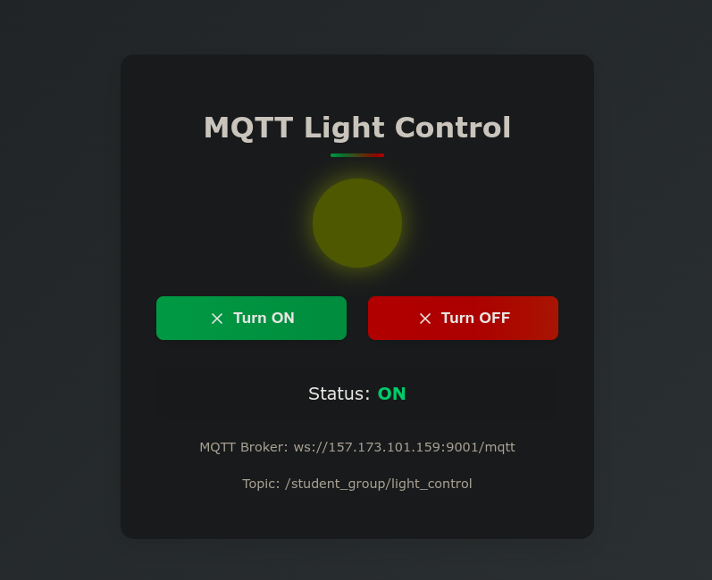
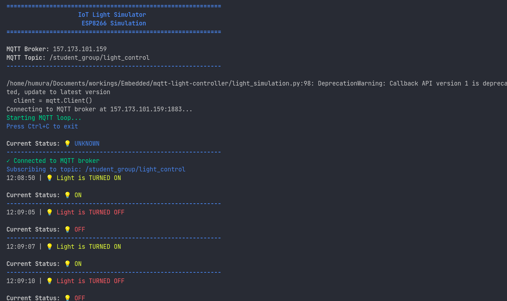

# MQTT-Based Light Control System

This project demonstrates an IoT light control system using MQTT protocol. It consists of:
1. A web interface to control the light (ON/OFF)
2. A Python script simulating an ESP8266 IoT device that receives the commands

## Components

### 1. Web Interface (`index.html`)
- Provides a user-friendly interface with ON/OFF buttons
- Visually shows the current state of the light
- Connects to an MQTT broker over WebSockets
- Publishes commands to the MQTT topic

### 2. IoT Device Simulator (`light_simulation.py`)
- Simulates an ESP8266 microcontroller
- Subscribes to the MQTT topic
- Prints the light status when commands are received
- Provides a visual CLI interface with color-coded status messages

## Setup Instructions

### Prerequisites
- Python 3.x
- Paho MQTT library for Python
- Modern web browser
- MQTT broker access (using the provided broker at 157.173.101.159)

### Installation

1. Clone this repository:
```bash
git clone https://github.com/yourusername/mqtt-light-control.git
cd mqtt-light-control
```

2. Install the required Python packages:
```bash
pip install paho-mqtt
```

### Running the Application

1. Start the IoT device simulator:
```bash
python light_simulation.py
```

2. Serve the web interface using a simple HTTP server:
```bash
# If you're using Python 3.x
python -m http.server 8000
```

3. Open your web browser and navigate to:
```
http://localhost:8000
```

4. Use the ON/OFF buttons to control the simulated light.

## MQTT Configuration

- **Broker**: ws://157.173.101.159:9001/mqtt (WebSocket) and 157.173.101.159:1883 (TCP)
- **Topic**: /student_group/light_control

## Features

- **Real-time updates**: Both the web interface and simulator update in real-time
- **Resilient connection**: Automatically reconnects if the connection is lost
- **Visual feedback**: The web interface includes a light indicator and status messages
- **Detailed terminal output**: The simulator provides color-coded terminal output for easy monitoring

## Screenshots


*Web Interface for controlling the light*


*Simulator terminal output showing light status*

## License

This project is licensed under the MIT License - see the LICENSE file for details.

## Acknowledgments

- This project was created as part of an IoT course assignment.
- Uses the Paho MQTT library for Python and JavaScript MQTT client for the web interface.